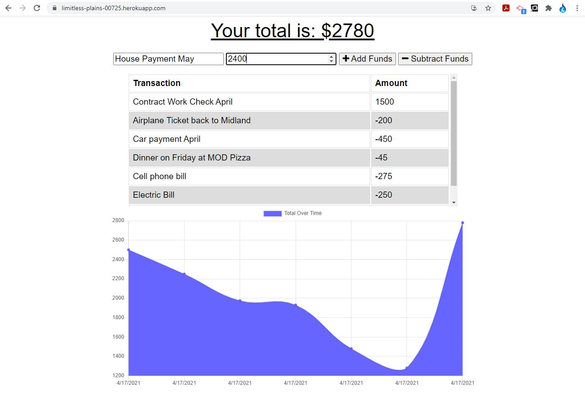
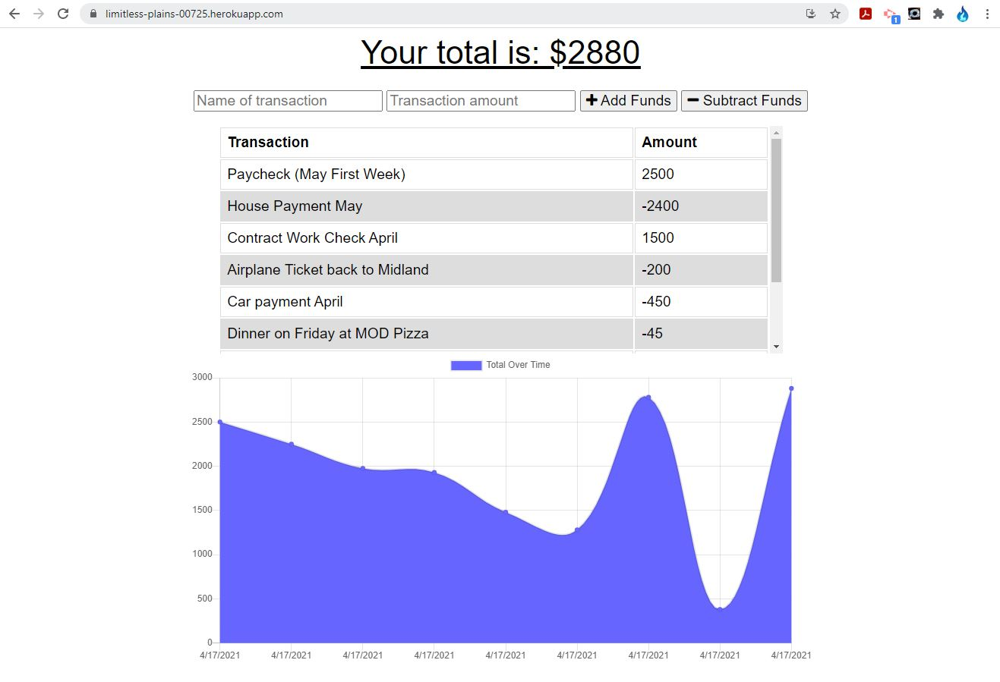

# The Llanes Budget Tracker

## Deployed site

-   https://limitless-plains-00725.herokuapp.com/
-   https://github.com/mrllanes/Budget-Tracker

## Table of Contents

-   [Description](#description)
-   [Installation](#installation)
-   [Usage](#usage)
-   [Technology](#technology)
-   [Contributions](#contributions)
-   [Questions](#questions)

## Description

Keeping track of your money is extremely important. Here is a simple budget tracker for your own personal use. Keep track of money coming in and money going out. If you lose connection to the internet, no problem! This smart budget tracker will still keep track of your transactions and will sync up when you reconnect online!

## Installation Instructions

You can clone this repo to your personal machine and use the "npm install" command to install all the needed node dependencies. Then use the "npm start" command to launch the application, and open your browser to "localhost:3000" to start using the tracker. You can also simply use the online version by going to the link above.

## Usage

Upon opening the site you will see two fields to enter information and to add or subtract funds. Enter the name of your transaction (Electric Bill) and the amount ($150) and then if that amount should be added or subtracted from your total. Enter all your billing information and watch it keep track. If you are not online when you enter information, that is OK, the app will keep track of information offline and update it when you reconnect to the network!

## Technology Stack

The following technologies were used to create this site/application/software/project:
Node, JavaScript, Mongoose, Service Worker, and more!

## Contributions

The following individuals contributed to the creation of this site/application/software/project:
Super Awesome support team and Incredibly Awesome Instructor/Facilitator. Also very nice and enthusiastic Cohort members.

## Questions

If you have questions or comments about this project, please feel free to contact me via e-mail:
llanesm@gmail.com

You can also find more of my projects on my GitHub page:
https://github.com/mrllanes

## Screenshots

Please see the images below to see how the Llanes Workout Tracker App looks!

